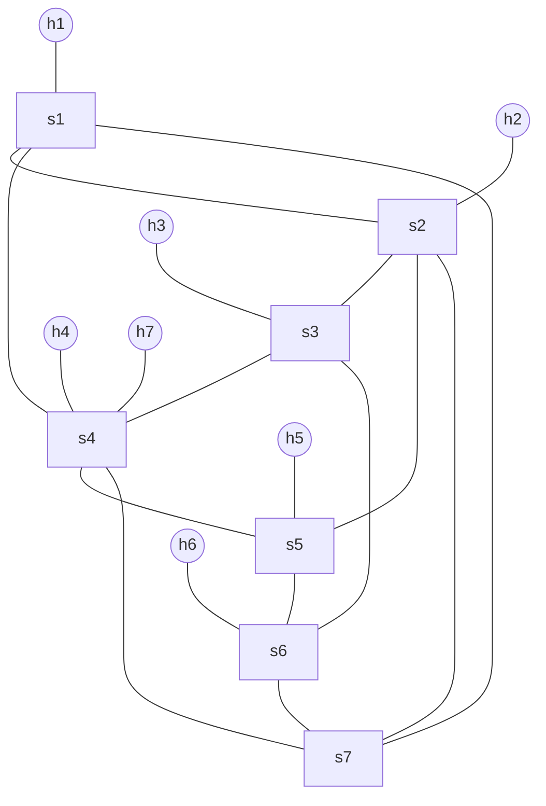

# Complex Case Topology

This document matches:

- `tests/switching_test/complex_topology_demo.py`
- `tests/firewall_test/firewall_complex_topology_demo.py`

## Mermaid Topology



## Scale Check

- Hosts: 7
- Switches: 7
- Inter-switch edges: 12

This satisfies the instruction requirement of more than 6 hosts, more than 6 switches, and more than 10 edges.

## Shortest Paths Between Hosts

```text
h1-h2: h1 -> s1 -> s2 -> h2 | distance=3
h1-h3: h1 -> s1 -> s2 -> s3 -> h3 | distance=4
h1-h4: h1 -> s1 -> s4 -> h4 | distance=3
h1-h5: h1 -> s1 -> s2 -> s5 -> h5 | distance=4
h1-h6: h1 -> s1 -> s7 -> s6 -> h6 | distance=4
h1-h7: h1 -> s1 -> s4 -> h7 | distance=3
h2-h3: h2 -> s2 -> s3 -> h3 | distance=3
h2-h4: h2 -> s2 -> s1 -> s4 -> h4 | distance=4
h2-h5: h2 -> s2 -> s5 -> h5 | distance=3
h2-h6: h2 -> s2 -> s3 -> s6 -> h6 | distance=4
h2-h7: h2 -> s2 -> s1 -> s4 -> h7 | distance=4
h3-h4: h3 -> s3 -> s4 -> h4 | distance=3
h3-h5: h3 -> s3 -> s2 -> s5 -> h5 | distance=4
h3-h6: h3 -> s3 -> s6 -> h6 | distance=3
h3-h7: h3 -> s3 -> s4 -> h7 | distance=3
h4-h5: h4 -> s4 -> s5 -> h5 | distance=3
h4-h6: h4 -> s4 -> s3 -> s6 -> h6 | distance=4
h4-h7: h4 -> s4 -> h7 | distance=2
h5-h6: h5 -> s5 -> s6 -> h6 | distance=3
h5-h7: h5 -> s5 -> s4 -> h7 | distance=3
h6-h7: h6 -> s6 -> s3 -> s4 -> h7 | distance=4
```

## Demo Operations To Cover

The topology is designed for these operations:

- `handle_host_add`: triggered during startup when hosts send `arping`
- `handle_switch_add`: triggered when the topology starts, and again when a stopped switch is restarted
- `handle_switch_delete`: `switch s6 stop`
- `handle_link_add`: `link s2 s5 up`
- `handle_link_delete`: `link s2 s5 down`
- `handle_port_modify`: `sh ovs-ofctl mod-port s4 4 down` and `... up`

## Suggested Demo Commands

Inside Mininet CLI:

```text
pingall
net
switch s6 stop
switch s6 start
link s2 s5 down
link s2 s5 up
sh ovs-ofctl mod-port s4 4 down
sh ovs-ofctl mod-port s4 4 up
arping_all
```
