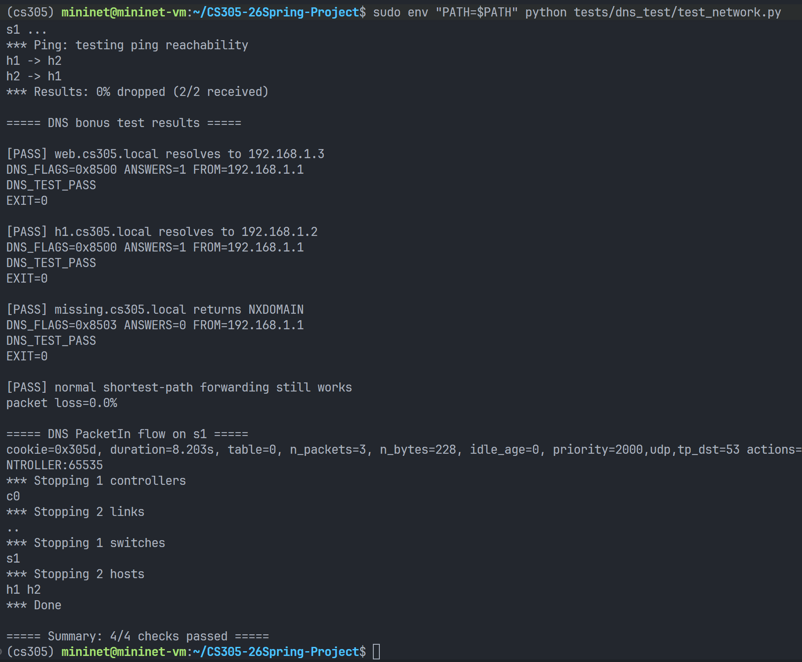

### Bonus4 DNS report

> 12410922@0523   
>
> 写不了一点英文版，等后面整合的时候机翻一下好了。


这一部分实现了控制平面中由controller管理的DNS server。

#### 1.大致实现思路

首先controller在初始化的时候，也会初始化一个DNS server，此时会从**静态配置的json文件**中读取DNS server的ip, mac等信息，以及DNS 域名ip映射的表格。

controller的handle_switch_add()中，增加switch的时候，会增加一条较高优先级的规则：当匹配到IPv4 UDP 53的时候，就会发送给controller处理，而不是使用最短路的转发逻辑。

同时，controller在ARP处理中对虚拟DNS IP 192.168.1.1进行响应，返回配置中的虚拟DNS MAC，使host能够正常向该虚拟DNS server发包。

controller的handle_non_dhcp_packet()中，新增了对DNS packet的处理。调用handle_dns() 如果是DNS请求，就返回True并且将DNS response回给发起请求者。

dns_server.py中的handle_dns()做了处理dns request的工作。对传入的pkt进行解析，如果是一个dns request包，那么就切出UDP payload也就是query的内容，然后根据query和DNS映射表格，构建出response，再构建出完整的以太网帧，最后发回请求的host

这样就实现了controller控制的中心化的DNS server，提供域名的解析服务了。

#### 2.测试

使用`tests/dns_test/test_network.py` 进行mininet的测试。

构建的拓扑是 h1----s1----h2

```
h1 = self.addHost("h1", ip="192.168.1.2/24")
h2 = self.addHost("h2", ip="192.168.1.3/24")
s1 = self.addSwitch("s1")
self.addLink(h1, s1)
self.addLink(h2, s1)
```

其中h1这个IP对应的域名是h1.cs305.local

h2的IP是192.168.1.3，同时DNS配置中h2.cs305.local和web.cs305.local都映射到该地址。

搭建完成后交换机s1连接外部的os-ken controller

case1 验证web.cs305.local可以正确解析为192.168.1.3

case2 验证h1.cs305.local可以正确解析为192.168.1.2

case3 验证一个没有在json文件中的域名会返回NXDOMAIN 

case4 验证普通最短路径转发功能没有被DNS扩展破坏。

最后打印flow table，检查controller下发到交换机的UDP/53 PacketIn flow是否存在。

#### 3.测试结果



可以看出，能够将web.cs305.local 正确解析成192.168.1.3，也能够将h1.cs305.local 正确解析成192.168.1.2,这些都是在静态的DNS文件中有的。

对于一个不存在的域名missing.cs305.local 会返回NXDOMAIN

对于正常的非DNS的包，也会走正常的最短路，而不是走controller被DNS解析，丢包率为0

因此测试是通过的。

同时，在最后打印的flow table中也可以找到这一条接收udp端口号为53的DNS请求，并且action 是转发给controller，因此确实controller将DNS的规则下发给router了。

#### 4.总结

本次 Bonus 4 中，我们基于 os-ken 实现了一个运行在 controller 侧的轻量级 DNS responder。该功能通过在交换机中安装高优先级 UDP/53 PacketIn 流表，将主机发往虚拟 DNS 服务器 192.168.1.1 的查询请求转交给 controller 处理。controller 负责响应虚拟 DNS IP 的 ARP 请求、解析 DNS A 记录查询、读取本地静态域名表，并通过 PacketOut 构造并返回 DNS response。测试结果表明，已配置域名可以正确解析，未知域名可以返回 NXDOMAIN，同时普通的最短路径转发功能仍然保持正常。因此，该实现证明了 controller 不仅可以完成基础转发控制，也可以通过 os-ken 扩展实现更高层的网络服务功能。
