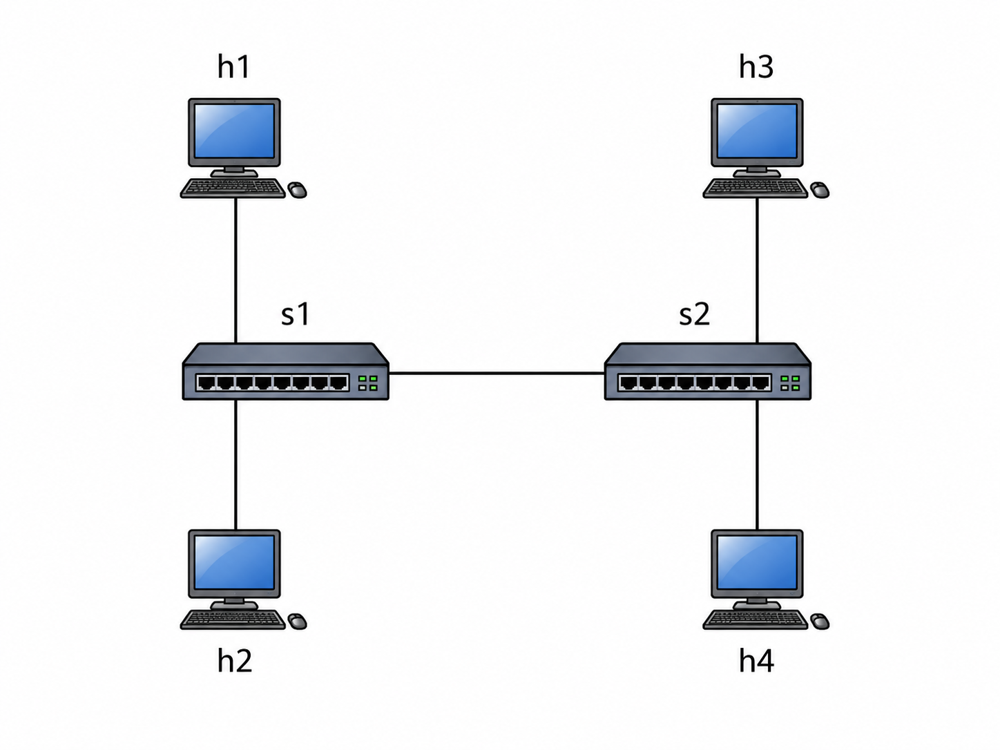

### Bonus5 Bufferbloat Report

> 12410922

#### 1. 实验背景

本次 Bonus5 选择研究 **Bufferbloat**，也就是“缓冲区膨胀”问题。网络设备中的buffer如果太大，数据包不会马上被丢弃，而是会在队列中排很久。这样 TCP 大流量可能还能保持**较高吞吐量**，但小包流量，例如 `ping`、DNS等会被迫一起排队，导致延迟明显升高。

因此，本实验要验证：大队列虽然可能提高 TCP 吞吐量、减少丢包，但会显著增加交互流量的 RTT，这就是 Bufferbloat 的主要现象。

#### 2. 实验设计思路

实验使用 Mininet 搭建如下的拓扑：



节点作用如下：

| 节点 | 作用 |
| --- | --- |
| h1 | TCP 大流量发送端 |
| h3 | TCP 大流量接收端，运行 `iperf` server |
| h2 | 延迟测试发送端，运行 `ping` |
| h4 | 延迟测试接收端 |
| s1-s2 | 瓶颈链路 |

链路设置如下：

| 链路 | 带宽 | 延迟 | 说明 |
| --- | --- | --- | --- |
| 主机到交换机 | 100 Mbps | 1 ms | 避免成为瓶颈 |
| s1-s2 | 1 Mbps | 20 ms | 人为制造瓶颈 |

其中，`s1-s2` 是唯一瓶颈链路。实验只改变这条链路的队列大小：

- 小队列：`20 packets`
- 大队列：`1000 packets`

实验中，`h1 -> h3` 使用 `iperf` 产生持续 TCP 大流量，`h2 -> h4` 同时使用 `ping` 测量 RTT。因为两条流都经过 `s1-s2`，所以可以观察瓶颈队列对延迟的影响。

#### 3. 测试方法

运行命令：

```bash
sudo mn -c
sudo env "PATH=$PATH" python tests/bonus5_bufferbloat/test_bufferbloat.py
```

脚本会自动完成两组实验：首先使用queue_size=20 packets 的小容量buffer，再使用queue_size=1000 packets 的大容量buffer。

每组实验都会记录：

- 空闲时 `h2 -> h4` 的 ping 平均 RTT。
- TCP 大流量运行时 `h2 -> h4` 的 ping 平均 RTT。
- `h1 -> h3` 的 TCP 吞吐量。
- ping 丢包率。

#### 4. 测试结果

本次实验输出的关键结果如下：

| 队列大小 | 空闲 ping 平均 RTT | TCP 流量下 ping 平均 RTT | TCP 吞吐量 | ping 丢包率 |
| --- | ---: | ---: | ---: | ---: |
| 20 packets | 51.874 ms | 292.334 ms | 1.15 Mbits/sec | 3.33333% |
| 1000 packets | 53.713 ms | 1677.748 ms | 2.24 Mbits/sec | 0.0% |

可以看到，两组实验在空闲状态下 RTT 都约为 50 ms，说明基础链路条件基本一致。

大队列下 TCP 吞吐量从 `1.15 Mbits/sec` 提高到 `2.24 Mbits/sec`，并且 ping 丢包率从 `3.33333%` 降到 `0.0%`。说明较大的buffer可以提高吞吐量，也可以降低丢包率。

但是在 TCP 大流量运行时，小队列的 ping 平均 RTT 为 `292.334 ms`，大队列的 ping 平均 RTT 为 `1677.748 ms`，大队列下的 RTT 约为小队列的 `5.7` 倍。说明大队列的代价是阻塞小的packets，使得RTT很大。

因此，大队列带来了“高吞吐、低丢包、但高延迟”的结果，这正是 Bufferbloat 的典型表现。

#### 5.总结

本次 Bonus5 使用 Mininet 和 `TCLink` 搭建了一个可重复的 Bufferbloat 实验。实验通过改变瓶颈链路队列大小，对比了小队列和大队列下的 TCP 吞吐量与 ping RTT。

实验结果表明，大队列虽然可以提高 TCP 吞吐量并减少丢包，但会让交互流量的延迟显著升高。本次实验验证了 Bufferbloat 的核心问题：网络性能不能只看吞吐量，还需要同时关注延迟。
