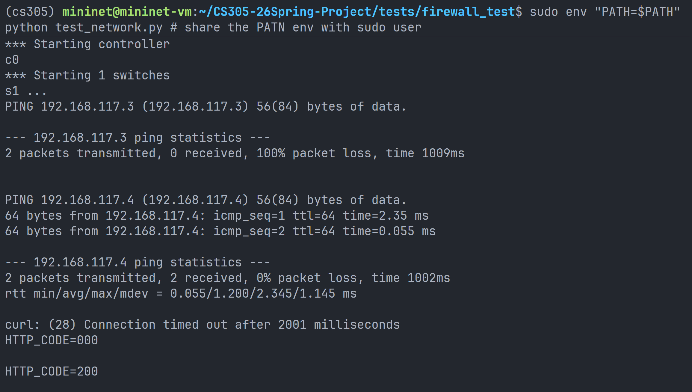

# Firewall Report

> 12410922 @ 0523

#### 1. Core Design

The firewall is implemented in the SDN controller. It reads policies from `firewall_rule.json`, converts them into `FirewallRule` objects, and installs the firewall rules on every switch with high-priority. Packet filtering is therefore enforced directly in the switch flow table, so the function of firewall is accomplished.

#### 2. Implementation Details

In `firewall.py`, each JSON rule is stored as a `FirewallRule`. It records the source IP, destination IP, protocol, source port, destination port, and action of one firewall rule. The controller creates one `Firewall` object when it starts.

The `_load_rules()` function loads rules from `firewall_rule.json`. It parses the top-level `rules` list and converts every rule dictionary into a `FirewallRule` object. If a rule does not explicitly provide an action, the default action is treated as `deny`.

Before installing flows, normalization steps are needed. Wildcard values such as `*`, `any`, empty strings, and `None` are treated as unspecified fields. Protocol names are converted into OpenFlow-compatible IP protocol numbers:

| Protocol | Number |
| --- | --- |
| ICMP | 1 |
| TCP | 6 |
| UDP | 17 |

Ports are also normalized. Wildcard ports are converted to `0`, while explicit ports are converted to integers. Invalid ports are skipped to avoid installing incorrect flow entries.

The `install_rules()` function installs every `deny` rule on every switch. Each rule is translated into an OpenFlow match with `dl_type=IP`, source IP, destination IP, protocol, and optional TCP/UDP port fields. Each `deny` rule is installed with an empty action list, so matched packets are dropped directly by the switch.

The firewall priority is `60000`, which is higher than the normal forwarding flow priority. Therefore, denied packets are dropped before they can match ordinary forwarding rules.

#### 3. Firewall Test

I first used the official basic firewall test in `tests/firewall_test/test_network.py`. This test uses a simple topology with h1, h2, and h3 connected to one switch.

The official test passed. It shows that h1 to h2 ICMP and h1 to h2 TCP/80 are blocked, while h1 to h3 ICMP and h1 to h2 TCP/8080 are still allowed.



#### 4. Complex Test Topology Introduction

To demonstrate robustness of firewall, I added `tests/firewall_test/firewall_complex_test.py`. The test uses five hosts and five switches with multiple redundant paths, and its topology is shown below.

```text
          h3
          |
h1 --- s1 --- s2 --- h4
       | \    |
       |  \   |
       s4  s3
       | \  /
       |  s5 --- h2
       |
       h5
```

Host IP addresses:

| Host | IP address |
| --- | --- |
| h1 | `192.168.117.2/24` |
| h2 | `192.168.117.3/24` |
| h3 | `192.168.117.4/24` |
| h4 | `192.168.117.5/24` |
| h5 | `192.168.117.6/24` |

Because the topology is more complex than the official test, the script includes a warm-up stage before checking the final results. During warm-up, all hosts send gratuitous ARP packets several times, and the script also runs `pingAll()` once. This gives the controller enough time to discover hosts, learn IP-MAC mappings, collect link information, and install normal forwarding rules. After this stage, the test results focus on firewall behavior instead of temporary packet loss caused by topology discovery.

 

The test starts HTTP servers on:

- h1 TCP port 8081
- h2 TCP port 80
- h2 TCP port 8080

It then checks both blocked and allowed traffic across the multi-switch topology.

You can use the following command to test. Open two terminals.

Controller terminal:

```bash
cd ~/CS305-26Spring-Project
conda activate cs305
osken-manager --observe-links controller.py
```

Mininet test terminal:

```bash
cd ~/CS305-26Spring-Project
conda activate cs305
sudo mn -c
sudo env "PATH=$PATH" python tests/firewall_test/firewall_complex_test.py
```

The controller must be started from the project root so that `firewall_rule.json` can be loaded correctly.

#### 5. Complex Test Results

All the test cases passed, showing great robustness of complex topological network.

Detailed results:

| Test case | Result | Meaning |
| --- | --- | --- |
| h1 -> h2 ICMP | PASS, blocked | Matches the ICMP deny rule |
| h1 -> h3 ICMP | PASS, allowed | Different destination, no rule matched |
| h4 -> h2 ICMP | PASS, allowed | Different source, no rule matched |
| h2 -> h1 TCP/8081 | PASS, allowed | Reverse TCP traffic is not blocked |
| h5 -> h3 ICMP | PASS, allowed | Unrelated hosts remain reachable |
| h1 -> h2 TCP/80 | PASS, blocked | Matches the TCP/80 deny rule |
| h1 -> h2 TCP/8080 | PASS, allowed | Same hosts, but different destination port |

The test also prints firewall flow entries from every switch. The following output from `s1` shows that the two deny rules were installed as high-priority drop flows:

```text
cookie=0x305f, duration=117.515s, table=0, n_packets=5, n_bytes=490,
priority=60000,icmp,nw_src=192.168.117.2,nw_dst=192.168.117.3 actions=drop

cookie=0x305f, duration=117.515s, table=0, n_packets=2, n_bytes=148,
priority=60000,tcp,nw_src=192.168.117.2,nw_dst=192.168.117.3,tp_dst=80 actions=drop
```

The same entries are installed on all switches. This confirms that denied traffic is dropped in the data plane before normal forwarding rules are matched.

#### 6. Conclusion of Firewall Part

The firewall correctly loads JSON policies, converts them into OpenFlow drop flows, and installs them on all switches with higher priority than normal forwarding rules. The complex Mininet test shows that the firewall blocks only the specified h1-to-h2 ICMP and TCP/80 traffic while allowing unrelated hosts, reverse TCP traffic, and TCP/8080. This demonstrates that the firewall is selective and robust in a multi-switch topology with redundant paths.
